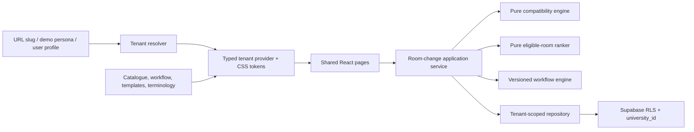

# Architecture

RoomReady is a modular monolith with tenant-aware boundaries around one deterministic core.

## Tenant layer

`tenantConfigs.ts` contains complete local fixtures for NYU and UIUC. `TenantContext` resolves the first URL segment and exposes only a typed `TenantConfig`. `resolveTenant` also accepts profile, demo, and future domain/SSO signals; a non-platform user conflict is blocked.

The provider defines `--tenant-primary`, `--tenant-secondary`, `--tenant-accent`, and `--tenant-surface`. Components do not contain university colours or office names.

## Domain layer

`evaluateCompatibility` compares active functional requirements to room features by stable `FeatureType`. Required unavailable or temporarily unavailable features fail; unknown data requests verification; preferences do not fail a room. Optional label maps affect explanations only.

`rankAlternativeRooms` first requires full compatibility and schedule availability. Eligible rooms are then scored using capacity, building continuity, travel, verification freshness, and disruption.

## Workflow layer

A definition is tenant-owned and versioned. Creating an instance deep-copies the definition into `definitionSnapshot`. Step instances use pending, active, blocked, completed, skipped, or cancelled. Completing the active step deterministically activates the next pending step.

## Presentation

The same student, alert, comparison, case, room, notification, simulator, and setup components render both universities. Routes are slug-prefixed. The competition switcher changes both tenant and persona and displays a transition shield while the provider changes.

## Persistence

Browser storage is intentionally limited to tenant-keyed, resettable competition state. Production state belongs in Supabase. The normalized schema carries `university_id`, scoped constraints, indexes, and RLS on every tenant-owned table.

## Trust boundaries

- Students access only their own private records.
- Instructors receive privacy-safe course-level notices, not feature profiles.
- Facilities receive room problems and operational feature requirements, never diagnoses.
- Scheduling staff receive compatibility and room recommendation data.
- University administrators manage their configuration.
- Platform administrators manage university metadata without automatic student access.
